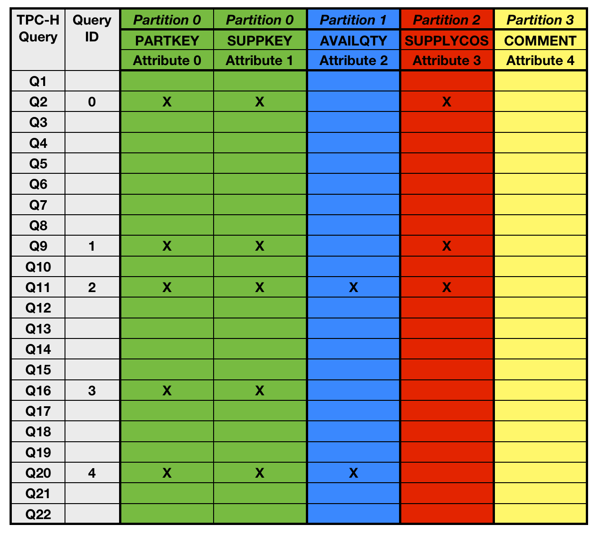

# Vertical partitioning algorithms used in physical design of databases

## Introduction

Vertical partitioning is a crucial step in physical database design, mainly used in disk-based row-store database systems. A number of vertical partitioning algorithms have been proposed over the last three decades for a variety of niche scenarios. In principle, the underlying problem remains the same: decompose a table into one or more vertical partitions, i.e. find a complete and (disjunct) partitioning of the set of attributes of a table such that it is optimal with respect to a cost function.

We implemented the following 6 + 1 vertical partitioning algorithms in Java:

1. **AutoPart** [S. Papadomanolakis and A. Ailamaki. AutoPart: Automating Schema Design for Large Scientific Databases Using Data Partitioning. In SSDBM, pages 383–392, 2004.]
2. **HillClimb** [R. A. Hankins and J. M. Patel. Data Morphing: An Adaptive, Cache-Conscious Storage Technique. In VLDB, pages 417–428, 2003.]
3. **HYRISE** [M. Grund, J. Krüger, H. Plattner, A. Zeier, P. Cudre-Mauroux, and S. Madden. HYRISE: A Main Memory Hybrid Storage Engine. PVLDB, 4(2):105–116, 2010.]
4. **Navathe** [S.Navathe, S.Ceri, G.Wiederhold, and J.Dou. Vertical Partitioning Algorithms for Database Design. ACM TODS, 9(4):680–710, 1984.]
5. **O2P** [A.Jindal and J.Dittrich. Relax and let the database do the partitioning online. In BIRTE, pages 65–80, 2011.]
6. **Trojan Layouts** [A.Jindal, J.-A. Quianeé-Ruiz, and J.Dittrich. Trojan Data Layouts: Right Shoes for a Running Elephant. In ACM - SOCC, pages 21:1–21:14, 2011.]
7. **Brute Force**

Read about our findings for legacy row-store database systems in our VLDB'13 paper [Jindal, A., Palatinus, E., Pavlov, V., & Dittrich, J. (2013). A comparison of knives for bread slicing. Proceedings of the VLDB Endowment, 6(6), 361-372.](http://www.vldb.org/pvldb/vol6/p361-jindal.pdf)


## A short walk-through of a sample vertical partitioning

Let's take a look at the TPC-H PartSupp table's workload, and it's vertical partitioning.  The table shows the following informations: which query references which attribute, marked by an X.



In our implementation each `Workload` is first reduced by kicking out queries which do not touch the given table. Furthermore, the workload is converted to a more efficient representation using primitive types only (called `SimplifiedWorkload` in the code), using GNU Trove collections. As a result of this step performed on the TPC-H PartSupp table we get only 5 queries (with IDs 0 to 4, shown in the second column in the above Figure).

Now let's run the AUTOPART algorithm for the PartSupp table. Here's the output of the run:

```
partsupp
1 #AUTOPART
0.0038134 #seconds computation time
4 #partition count -- partitions:
1 0
2
3
4
5 #query count -- best solutions:
2 0
2 0
2 1 0
0
1 0
```

We get two mappings as a result. _Partitions_ is the result of a VP algo: the list of partitions with the attributes in them. Thus the first line (1 0) means Partition 0 contains attributes 1 and 0 (marked green in the figure).

The second mapping, _best solutions_ is a bit more tricky. If we have a vertically partitioned table, and a query comes in, we have to decide which vertical partitions we should scan to answer the query. This itself is an NP-hard problem when partial attribute replication is allowed, like in the AUTOPART algorithm (Note: these algos are called `AbstractPartitionsAlgorithm` in the code, in contrast to `AbstractPartitioningAlgorithm`s that create a disjunct set of partitions, i.e. without overlaps). The best solutions tells us for each query which partitions to scan, in order to answer the query WITH THE LOWEST COST, according to the cost model used (_Note_: this is only non-trivial for overlapping (non-disjunct) partitionings). Thus the first line (2 0) means query 0 (which is TPC-H Q2) needs to scan partitions 2 and 0 (the red and green columns in the figure).
